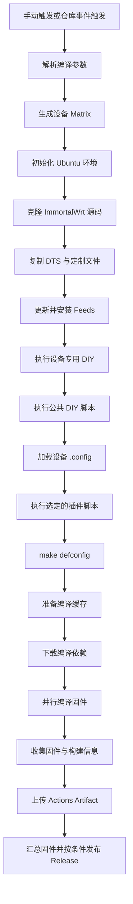

# ImmortalWrt 云编译项目

基于 GitHub Actions 的 ImmortalWrt 云编译项目，支持多设备构建、设备专用定制、插件脚本扩展、编译缓存、固件产物上传及 GitHub Release 发布。

## 功能特性

* **多设备编译**：支持选择指定设备，也可通过 `all` 编译多个设备。
* **源码自定义**：支持配置源码仓库、分支和指定 Commit。
* **设备定制**：通过设备配置文件、设备专用脚本和 DTS 文件适配不同路由器。
* **插件扩展**：可将插件安装逻辑写入 `scripts/*.sh`，并通过工作流参数选择执行。
* **编译优化**：使用并行编译与 ccache 缓存减少重复编译耗时。
* **固件归档**：收集固件与构建信息，上传 GitHub Actions Artifact，并可发布 Release。

## 一、云编译工作流程



### 工作阶段说明

1. **参数准备**：解析设备名称、源码仓库、分支、Commit 和发布选项。
2. **源码获取**：下载指定版本的 ImmortalWrt 源码。
3. **设备定制**：应用 DTS、设备专用脚本和公共 DIY 修改。
4. **配置生成**：加载目标设备的 `.config`，执行 `make defconfig`。
5. **插件处理**：根据工作流输入，执行选定的插件脚本。
6. **编译构建**：下载依赖，使用并行任务编译固件。
7. **产物处理**：收集固件、配置及构建信息，上传构建产物。
8. **固件发布**：在满足发布条件时创建 GitHub Release。

## 二、仓库目录布局

```text
ubi_build/
├── .github/
│   └── workflows/
│       └── 0-optimized-v2.yml
├── config/
│   ├── mt7981-QLB-4Pro.config
│   └── 其他设备配置文件
├── devices/
│   ├── diy-qlb-4pro.sh
│   └── 其他设备定制脚本
├── scripts/
│   ├── diy-part2.sh
│   ├── diy-PassWall.sh
│   └── 其他插件脚本
├── dts/
│   └── 设备对应的 DTS 文件
└── README.md
```

> 上述目录为功能示意，具体文件以仓库当前分支为准。

### 目录用途

| 目录                   | 用途                    |
| -------------------- | --------------------- |
| `.github/workflows/` | 定义触发条件、编译参数、任务依赖和发布逻辑 |
| `config/`            | 保存不同设备的编译配置模板         |
| `devices/`           | 保存设备专用的修改脚本           |
| `scripts/`           | 保存公共 DIY、插件安装和其他可复用脚本 |
| `dts/`               | 保存设备树文件，用于适配硬件        |
| `README.md`          | 项目说明、编译指南和维护文档        |

## 三、编译目录说明

编译任务主要使用以下目录：

| 路径                                | 说明                     |
| --------------------------------- | ---------------------- |
| `$GITHUB_WORKSPACE`               | 当前仓库的工作目录              |
| `/workdir/openwrt`                | ImmortalWrt 源码与编译工作目录  |
| `/workdir/.ccache`                | ccache 编译缓存目录          |
| `$GITHUB_WORKSPACE/firmware/设备名/` | 工作流整理后的固件输出目录（以实际脚本为准） |

仓库中的配置文件和定制脚本会在编译过程中被复制或应用到源码目录。编译结束后，固件会被整理并上传为 GitHub Actions Artifact。

## 四、设备配置与定制

每台设备建议使用独立配置文件和独立定制脚本。

* **配置文件**：控制目标平台、内核选项和预装软件包。
* **设备脚本**：处理设备专属的硬件参数、镜像定义及其他定制。
* **DTS 文件**：描述设备硬件布局及相关设备树信息。
* **公共脚本**：存放多个设备都需要执行的修改。

修改配置文件后，建议检查 `make defconfig` 的输出，确认需要的内核选项和软件包没有被自动移除。

## 五、自选插件脚本

可以将插件安装逻辑放入 `scripts/` 目录，例如：

```text
scripts/
├── diy-part2.sh
├── diy-PassWall.sh
├── diy-iStore.sh
└── diy-Aurora.sh
```

如果工作流已配置 `plugin_scripts` 输入，可以在 GitHub Actions 的 **Run workflow** 页面填写脚本文件名。

例如，选择 PassWall 和 Aurora：

```text
diy-PassWall.sh,diy-Aurora.sh
```

多个脚本使用英文逗号分隔，脚本文件应位于 `scripts/` 目录中。

### 插件脚本编写注意事项

1. 使用 Bash 兼容语法，并为脚本添加正确的执行权限。
2. 脚本需要修改 `.config` 时，应确保设备配置已经加载。
3. 如果脚本需要新增软件源，应确保新增的 Feeds 已更新并安装。
4. 不要重复执行已经由主工作流自动执行的公共脚本。
5. 执行插件脚本后，应通过 `make defconfig` 检查配置是否有效。

> 自选插件输入只有在工作流中实现并接入相应步骤后才会生效；仅添加脚本文件并不会自动执行。

## 六、构建产物

构建完成后，可在 GitHub 仓库的 Actions 页面打开对应运行记录，在 Artifacts 区域下载固件。

如果本次运行启用了 Release 发布，并且发布任务成功，也可以在仓库的 Releases 页面下载相应固件。

建议保留每次构建的设备名称、源码分支、Commit、最终配置及构建日志，以便排查编译失败和固件差异。

## 七、常见问题

### 1. 找不到 `.config`

确认设备配置文件路径正确，并且在执行 `make defconfig` 或需要修改 `.config` 的插件脚本之前，已将配置复制到源码根目录。

### 2. 插件脚本未执行

检查工作流是否定义 `plugin_scripts` 输入、是否传递到环境变量，以及对应脚本是否存在于 `scripts/` 目录。

### 3. 固件没有上传

检查编译是否成功、固件收集路径是否正确，以及 Artifact 上传步骤是否被跳过或失败。

### 4. Release 任务被跳过

检查 Release 开关、任务依赖、条件表达式及上游构建任务状态。Artifact 上传成功并不代表 Release 一定会创建。

---

**提示：** 请以当前仓库中的工作流和实际脚本为准。修改工作流时，建议先对单个设备执行测试编译，确认配置、插件和固件上传流程正常后，再使用 `all` 进行多设备构建。
